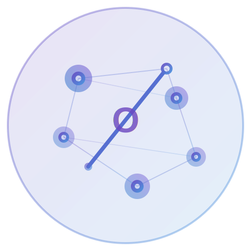

# Orcide

**Orchestrated Revolutionary Collaborative Intelligence Development Environment**

> *Orcide: Ignite Your Creative AI Orchestra.*

<div align="center">
  
</div>

---

Orcide is a self-hosted, open-source IDE for **LLM Orchestration** — the dedicated IDE companion to [Orcest.ai](https://orcest.ai). Built as a fork of VS Code, Orcide gives you a premium, visual environment for building, orchestrating, and deploying AI agents and workflows.

## ✨ Features

- 🤖 **AI Agent Modes** — Chat, Agent, and Gather modes for intelligent code assistance
- 🔗 **Multi-Model Support** — Connect to Anthropic, OpenAI, Gemini, Ollama, and 15+ providers
- 🏠 **Local-First** — Run models locally with Ollama, LM Studio, vLLM — your data stays private
- 🎯 **Smart Apply** — Fast Apply with Search/Replace or full file rewrite
- 🔧 **MCP Integration** — Model Context Protocol for extensible agent tools
- ⌨️ **Quick Edit (Ctrl+K)** — Inline code editing powered by AI
- 📝 **AI Commit Messages** — Auto-generate commit messages from diffs
- 🔄 **One-Click Migration** — Transfer settings from VS Code, Cursor, or Windsurf

## 🚀 Getting Started

### Self-Hosted (Docker)

```bash
docker build -t orcide .
docker run -p 10000:10000 orcide
```

Then open `http://localhost:10000` in your browser.

### Development Mode

1. Clone: `git clone https://github.com/danialsamiei/ide.orcest.ai`
2. Install: `npm install`
3. Build React: `npm run buildreact`
4. Compile: `npm run compile`
5. Launch: `./scripts/code.sh` (Linux/macOS) or `scripts\code.bat` (Windows)

See [HOW_TO_CONTRIBUTE.md](./HOW_TO_CONTRIBUTE.md) for detailed setup instructions.

## 🏗️ Architecture

Orcide is built on VS Code's Electron architecture with custom AI orchestration layers:

- **Frontend**: Monaco Editor + React with Tailwind CSS
- **AI Layer**: Multi-provider LLM integration via `src/vs/workbench/contrib/void/`
- **Backend**: Electron main process for native capabilities
- **Self-Hosted**: Docker-ready with web server mode

See [ORCIDE_CODEBASE_GUIDE.md](./ORCIDE_CODEBASE_GUIDE.md) for the full codebase guide.

## 🔗 Ecosystem

- 🌐 [Orcest.ai](https://orcest.ai) — AI Orchestration Platform
- 🚪 [Dargah.ai](https://dargah.ai) — Model Gateway & Routing
- 💻 [Orcide IDE](https://ide.orcest.ai) — This project

## 📄 License

[MIT License](./LICENSE.txt)

## 🤝 Contributing

We welcome contributions! See [HOW_TO_CONTRIBUTE.md](./HOW_TO_CONTRIBUTE.md) for guidelines.

- 🐛 [Report Issues](https://github.com/danialsamiei/ide.orcest.ai/issues)
- 📧 Contact: [hello@orcest.ai](mailto:hello@orcest.ai)
